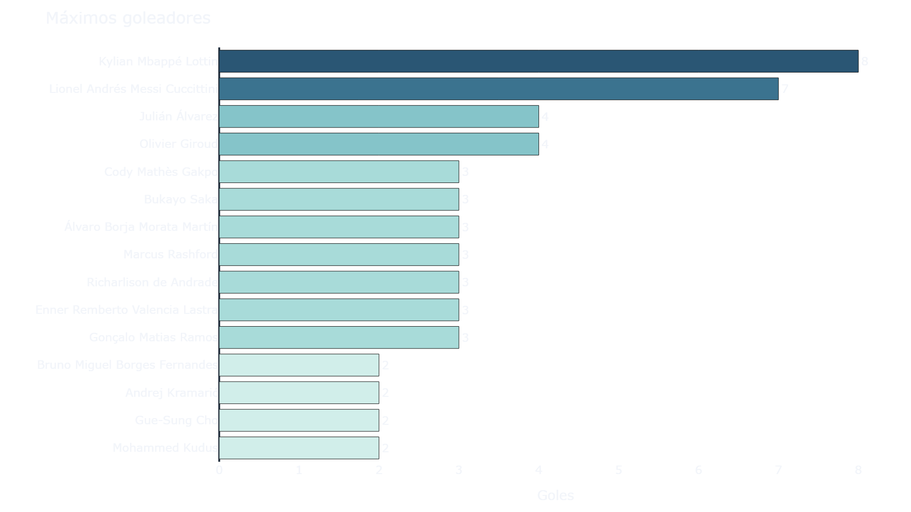
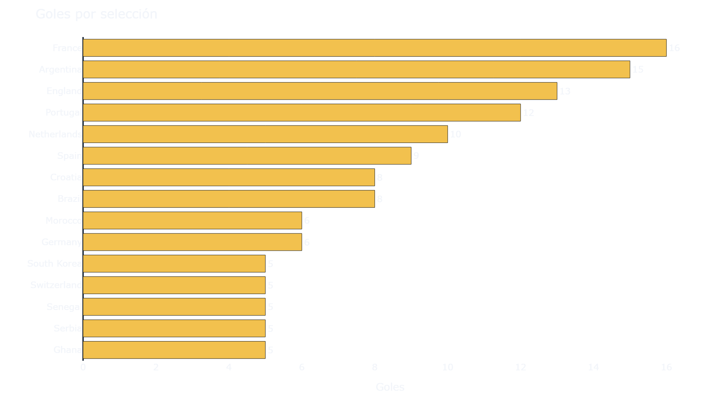
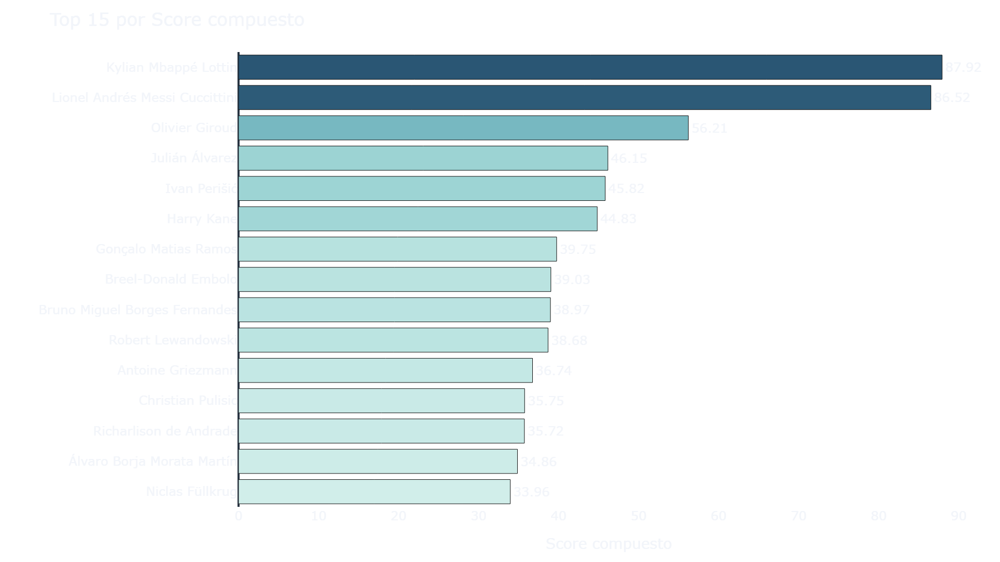
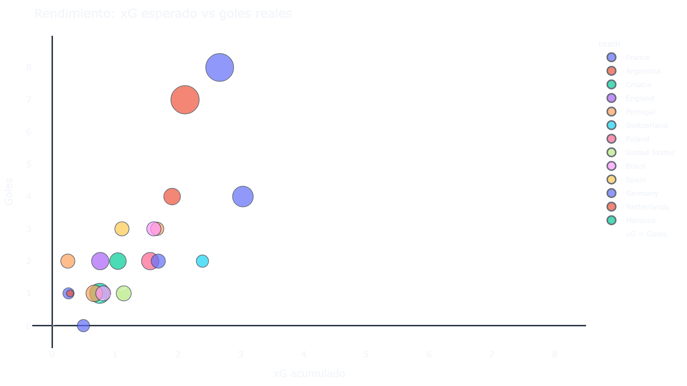
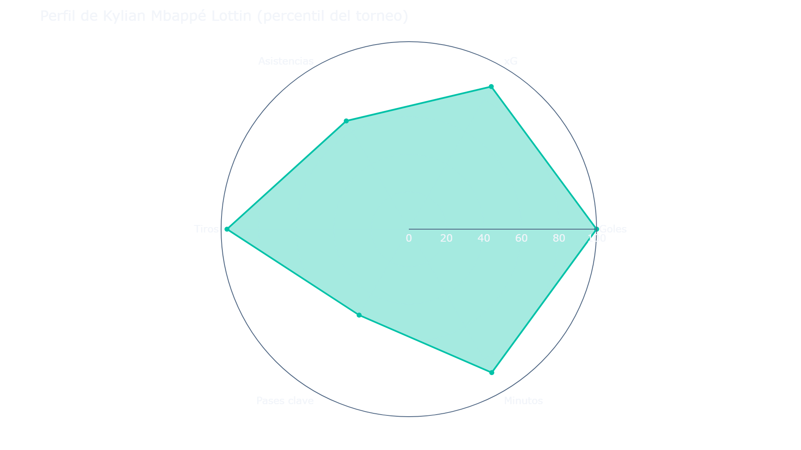
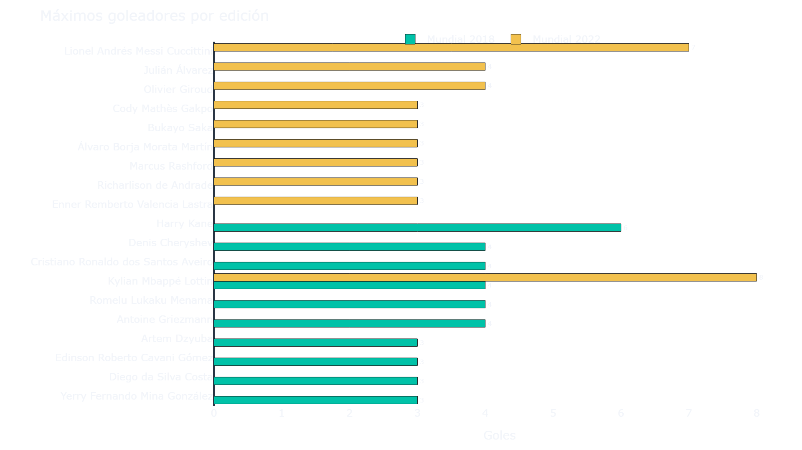
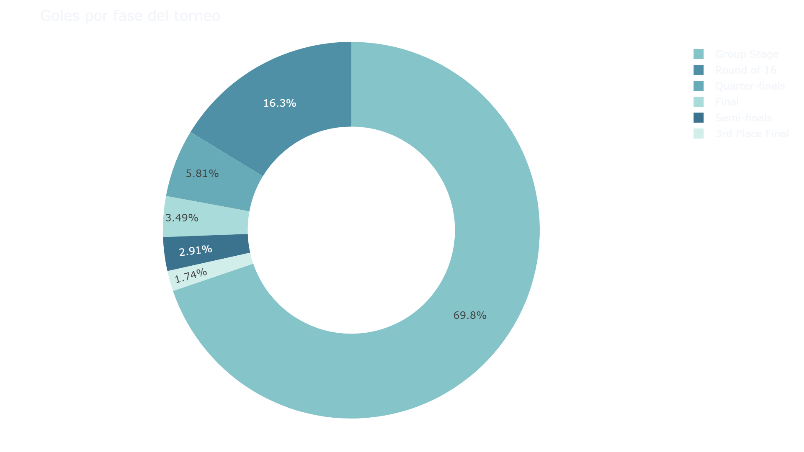
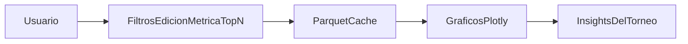
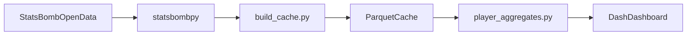

# Dashboard de análisis del Mundial FIFA (2018 y 2022)

**Python · Dash · Plotly · StatsBomb Open Data**

Explorador interactivo de rendimiento en los Mundiales de Rusia 2018 y Qatar 2022. A diferencia de una tabla de goles tradicional, este proyecto trabaja con **event data**: cada pase, tiro, sustitución y acción registrada por StatsBomb se transforma en métricas por jugador y se visualiza en un dashboard web reactivo.

El objetivo es acercar el análisis de fútbol basado en datos a cualquier persona interesada — desde aficionados curiosos hasta analistas que quieran entender cómo se construyen métricas como el **xG** (goles esperados) o un ranking de *top performers* a partir de eventos crudos.

---

## Vista previa (sin instalar nada)

No necesitas clonar el repo ni ejecutar Python para ver los resultados principales. Esta sección muestra **tablas**, **capturas estáticas** y un **informe HTML interactivo** (zoom y hover en los gráficos) generados desde los datos de StatsBomb.

### Informe interactivo en el navegador

Abre el informe Plotly standalone (sin servidor local):

**[Ver informe interactivo](https://htmlpreview.github.io/?https://raw.githubusercontent.com/luis20072002/Wrld-Cup-Dashboard/main/docs/report.html)**

> El enlace usa [htmlpreview.github.io](https://htmlpreview.github.io/) para renderizar el HTML versionado en este repo. Si el servicio no responde, las imágenes de abajo siguen disponibles en GitHub.

### Top goleadores — Mundial 2018

| # | Jugador | Selección | Goles | xG | Asist. |
|---|---------|-----------|------:|---:|-------:|
| 1 | Harry Kane | Inglaterra | 6 | 1.68 | 0 |
| 2 | Denis Cheryshev | Rusia | 4 | 1.11 | 0 |
| 3 | Cristiano Ronaldo | Portugal | 4 | 1.14 | 0 |
| 4 | Kylian Mbappé | Francia | 4 | 1.78 | 0 |
| 5 | Romelu Lukaku | Bélgica | 4 | 2.61 | 0 |
| 6 | Antoine Griezmann | Francia | 4 | 1.21 | 2 |
| 7 | Artem Dzyuba | Rusia | 3 | 0.87 | 2 |
| 8 | Edinson Cavani | Uruguay | 3 | 2.15 | 0 |
| 9 | Diego Costa | España | 3 | 2.30 | 0 |
| 10 | Yerry Mina | Colombia | 3 | 0.77 | 0 |

### Top goleadores — Mundial 2022

| # | Jugador | Selección | Goles | xG | Asist. |
|---|---------|-----------|------:|---:|-------:|
| 1 | Kylian Mbappé | Francia | 8 | 2.67 | 2 |
| 2 | Lionel Messi | Argentina | 7 | 2.11 | 3 |
| 3 | Julián Álvarez | Argentina | 4 | 1.91 | 0 |
| 4 | Olivier Giroud | Francia | 4 | 3.04 | 0 |
| 5 | Cody Gakpo | Países Bajos | 3 | 0.56 | 0 |
| 6 | Bukayo Saka | Inglaterra | 3 | 0.58 | 0 |
| 7 | Álvaro Morata | España | 3 | 1.11 | 1 |
| 8 | Marcus Rashford | Inglaterra | 3 | 1.38 | 0 |
| 9 | Richarlison | Brasil | 3 | 1.62 | 0 |
| 10 | Enner Valencia | Ecuador | 3 | 1.14 | 0 |

*Goles excluyen tandas de penales. xG excluye penaltis en tiempo reglamentario.*

### Galería de gráficos

**Resumen — máximos goleadores (2022)**



**Resumen — goles por selección (2022)**



**Top performers — ranking por score (2022)**



**Top performers — xG vs goles (2022)**



**Perfil del jugador líder por score (2022)**



**Comparativa 2018 vs 2022**



**Goles por fase del torneo (2022)**



> Estas capturas son una instantánea. Para filtrar por edición, métrica o jugador en tiempo real, ejecuta el dashboard Dash (sección [Instalación y ejecución](#instalación-y-ejecución)).
>
> Para regenerar las vistas previas tras actualizar datos: `py scripts/export_previews.py`

---

## Qué puedes explorar

El dashboard tiene cuatro pestañas. Cada una responde a una pregunta distinta sobre el torneo:

| Pestaña | Qué muestra |
|---------|-------------|
| **Resumen** | KPIs del torneo (goles, partidos, xG total, jugadores), máximos goleadores, goles por selección y distribución por fase (grupos vs eliminatorias). |
| **Top performers** | Ranking configurable por goles, xG, asistencias, minutos o score compuesto; scatter **xG vs goles** para detectar sobre/bajo rendimiento; tabla filtrable. |
| **Perfil de jugador** | Radar de percentiles dentro del torneo, mapa de tiros sobre el campo (coordenadas StatsBomb) y línea de tiempo de goles y asistencias. |
| **Comparativa 2018 vs 2022** | Totales agregados por edición y goleadores lado a lado entre ambos Mundiales. |

Flujo de interacción:



---

## Conclusiones del análisis

Estos hallazgos salen directamente del pipeline de agregación sobre los datos cacheados del proyecto (128 partidos, ~460 000 eventos en total):

### Mundial 2018 (Rusia)

- **Harry Kane** lideró la tabla de goleadores con **6 goles**, coincidiendo con la Bota de Oro oficial del torneo.
- Entre los máximos anotadores también destacaron **Denis Cheryshev** (4 goles) y **Cristiano Ronaldo** (4 goles).
- El análisis por **xG** permite contrastar quién convirtió más de lo esperado según la calidad de sus ocasiones y quién dejó rendimiento sobre la mesa.

### Mundial 2022 (Qatar)

- **Kylian Mbappé** fue el máximo goleador con **8 goles**, incluyendo un hat-trick en la final.
- **Lionel Messi** sumó **7 goles y 3 asistencias**, reflejando un rol más completo que el de puro finalizador.
- **Julián Álvarez** (4 goles) aparece entre los delanteros más productivos del torneo argentino.

### Lecturas transversales

- El gráfico **xG vs goles** separa jugadores que **finalizaron por encima** de sus ocasiones (sobre rendimiento) de quienes **no convirtieron** el volumen de peligro que generaron.
- La comparativa entre 2018 y 2022 es **a nivel de torneo** (totales, goleadores, dinámica general), no un seguimiento jugador a jugador entre ediciones: pocos futbolistas coinciden en ambos Mundiales con el mismo peso.
- Se **excluyen las tandas de penales** (`period != 5`) al contar goles y tiros, para no inflar estadísticas con acciones que no reflejan el juego open-play del partido.

---

## Fuente de datos

Todo el análisis se apoya en datos abiertos de StatsBomb, una de las fuentes más completas de *event data* en fútbol profesional.

| Recurso | Enlace | Uso en el proyecto |
|---------|--------|-------------------|
| StatsBomb Open Data | [github.com/statsbomb/open-data](https://github.com/statsbomb/open-data) | Repositorio oficial con partidos, eventos y alineaciones en JSON |
| statsbombpy | [github.com/statsbomb/statsbombpy](https://github.com/statsbomb/statsbombpy) | Cliente Python para descargar datos sin autenticación (open data) |
| User agreement | [StatsBomb Resource Centre](https://www.statsbomb.com/resource-centre/) | Términos de uso y atribución obligatoria |

### Cobertura utilizada

| Parámetro | Valor |
|-----------|-------|
| Competición | FIFA World Cup (`competition_id = 43`) |
| Edición 2018 | `season_id = 3` — 64 partidos |
| Edición 2022 | `season_id = 106` — 64 partidos |
| Eventos totales | ~227 000 (2018) + ~235 000 (2022) |
| Jugadores agregados | 603 (2018) · 680 (2022) |

### Limitaciones de la fuente

- **No hay datos del Mundial 2026** en open data: el torneo aún no se ha jugado y StatsBomb publica ediciones cuando están disponibles.
- Las estadísticas agregadas de pago (`player_match_stats`, `player_season_stats`) **no están incluidas** en open data. Por eso este proyecto **calcula manualmente** goles, xG, asistencias, minutos, etc. desde los eventos en [`src/player_aggregates.py`](src/player_aggregates.py) y [`src/minutes.py`](src/minutes.py).
- StatsBomb 360 (freeze frames contextuales) está disponible solo en partidos seleccionados de 2022; no se usa en esta versión del dashboard.

---

## Stack tecnológico

| Tecnología | Rol |
|------------|-----|
| **Python 3.11+** | Lenguaje base del pipeline y del dashboard |
| **statsbombpy** | Descarga de partidos y eventos desde GitHub de StatsBomb |
| **pandas / numpy** | Limpieza, joins, agregación y normalización de métricas |
| **pyarrow + Parquet** | Cache local en `data/processed/` — el dashboard arranca en segundos sin re-descargar |
| **Dash (Plotly)** | Framework web interactivo 100 % Python; callbacks reactivos sin escribir HTML |
| **Plotly** | Gráficos: barras, scatter, radar polar, mapa de tiros sobre campo |
| **dash-bootstrap-components** | UI con tema DARKLY: pestañas, cards KPI, layout responsive |

### Por qué Dash y no HTML o Quarto

- **Dash** encaja cuando necesitas filtros dinámicos (edición, métrica, top N, jugador) que actualizan varios gráficos a la vez mediante callbacks.
- **Quarto** es excelente para informes estáticos o semi-estáticos; aquí se priorizó una **app analítica interactiva** donde el usuario explora el torneo en tiempo real.
- Dash genera HTML por detrás, pero el desarrollador escribe solo Python — ideal para un perfil orientado a datos y machine learning.

---

## Arquitectura y pipeline de datos



### Paso 1 — Ingesta (`scripts/build_cache.py`)

- Descarga los 64 partidos de cada edición con `sb.matches(competition_id=43, season_id=...)`.
- Obtiene todos los eventos partido a partido con `sb.events(match_id=...)`.
- Guarda tres archivos Parquet por edición: `matches_`, `events_` (versión slim) y `player_stats_`.

### Paso 2 — Feature engineering (`src/`)

- [`player_aggregates.py`](src/player_aggregates.py): agrupa eventos por `player_id` y calcula métricas ofensivas y el score compuesto.
- [`minutes.py`](src/minutes.py): estima minutos jugados a partir de sustituciones en los eventos del partido.
- [`data_loader.py`](src/data_loader.py): lee el cache Parquet con `@lru_cache` para no recargar en cada callback.

### Paso 3 — Visualización (`app/`)

- [`layout.py`](app/layout.py): estructura de pestañas y controles.
- [`callbacks.py`](app/callbacks.py): conecta filtros del usuario con las figuras.
- [`figures/`](app/figures/): módulos Plotly por sección (overview, performers, player_profile, comparison).

---

## Metodología de métricas

Todas las métricas se derivan de columnas de eventos StatsBomb. Agrupación por `player_id` (identificador estable entre partidos).

| Métrica | Cálculo |
|---------|---------|
| **Goles** | Eventos `type == "Shot"` con `shot_outcome == "Goal"`, excluyendo tanda de penales |
| **xG** | Suma de `shot_statsbomb_xg` en tiros; excluye penaltis en tiempo reglamentario |
| **Tiros** | Conteo de eventos `Shot` |
| **Asistencias** | Pases con `pass_goal_assist == True` |
| **Pases clave** | Pases con `pass_shot_assist == True` |
| **xA (proxy)** | xG del tiro generado por cada pase clave, unido vía `shot_key_pass_id` |
| **Regates completados** | Dribbles con outcome `Complete` |
| **Minutos** | Minuto de salida − minuto de entrada según sustituciones; 90+ si no sale |
| **Partidos** | `match_id` únicos en los que participó |

### Score compuesto (ranking por defecto)

Cada componente se normaliza entre 0 y 1 **dentro del torneo** (min-max) y se pondera según [`src/config.py`](src/config.py):

```
score = 0.35 × goles_norm + 0.30 × xg_norm + 0.20 × asistencias_norm + 0.15 × minutos_norm
```

Los pesos reflejan que goles y xG capturan el impacto ofensivo directo, mientras asistencias y minutos aportan contexto de creación y continuidad en el torneo. Son configurables editando `SCORE_WEIGHTS`.

---

## Estructura del repositorio

```
Wrld_Cup_Predict/
├── requirements.txt          # Dependencias Python
├── run.bat / run.ps1         # Lanzadores rápidos (Windows)
├── scripts/
│   ├── build_cache.py        # Descarga StatsBomb y genera Parquet (ejecutar 1 vez)
│   └── export_previews.py    # Genera PNG + HTML para el README público
├── docs/
│   ├── report.html           # Informe Plotly interactivo (vista previa)
│   └── preview/              # Capturas PNG embebidas en el README
├── src/
│   ├── config.py             # IDs de torneo, rutas, pesos del score
│   ├── data_loader.py        # Lectura del cache + wrapper statsbombpy
│   ├── player_aggregates.py    # Métricas por jugador desde eventos
│   └── minutes.py              # Minutos jugados por partido
├── app/
│   ├── app.py                # Entry point del dashboard
│   ├── layout.py             # Layout con 4 pestañas
│   ├── callbacks.py          # Interactividad Dash
│   └── figures/              # Figuras Plotly por sección
└── data/processed/           # Cache Parquet (generado, no versionado en git)
```

---

## Instalación y ejecución

Requisito: **Python 3.11+**.

### Windows

En muchas instalaciones de Windows el comando `python` no está en el PATH. Usa el launcher **`py`**:

```powershell
py -m pip install -r requirements.txt
py scripts/build_cache.py
py app/app.py
```

Alternativas: doble clic en **`run.bat`** o `.\run.ps1`.

La primera ejecución de `build_cache.py` descarga ~128 partidos desde StatsBomb y puede tardar varios minutos. Las siguientes veces el dashboard lee solo el cache local.

Para acelerar la descarga:

```powershell
$env:SB_CORES=4; py scripts/build_cache.py
```

### Linux / macOS

```bash
pip install -r requirements.txt
python scripts/build_cache.py
python app/app.py
```

Abre [http://127.0.0.1:8050](http://127.0.0.1:8050) en el navegador.

---

## Limitaciones y trabajo futuro

- Las PNG y el HTML del README son una **instantánea**; no reemplazan los filtros dinámicos del dashboard Dash.
- Tras cambiar métricas o datos, re-ejecuta `py scripts/export_previews.py` y commitea `docs/` de nuevo.
- El informe interactivo depende de htmlpreview.github.io (servicio externo); las imágenes del README funcionan sin él.
- **Sin Mundial 2026** hasta que StatsBomb publique la edición en open data.
- La comparativa es **entre torneos**, no un tracking longitudinal de carrera por jugador.
- El cálculo de minutos depende de la calidad de eventos de sustitución; en partidos con datos incompletos se usa un fallback conservador.
- Extensiones posibles: modelo de predicción ML para 2026, integración de StatsBomb 360, despliegue en Render/Railway con cache pre-generado.

---

## Créditos y licencias

### Código — MIT License

El código fuente de este proyecto está bajo la [MIT License](LICENSE).

Copyright (c) 2026 Luis Eduardo Mendoza Angulo

### Datos — StatsBomb Open Data

- **Datos:** [StatsBomb Open Data](https://github.com/statsbomb/open-data). Al publicar o compartir análisis basados en estos datos, debes citar a **StatsBomb** como fuente y respetar su [user agreement](https://www.statsbomb.com/resource-centre/).
- Las métricas y visualizaciones son derivadas de eventos StatsBomb; los datos originales permanecen bajo los términos de StatsBomb, independientemente de la licencia MIT del código.

---

*Proyecto de análisis de fútbol con datos abiertos · Python · Dash · Plotly · StatsBomb*
